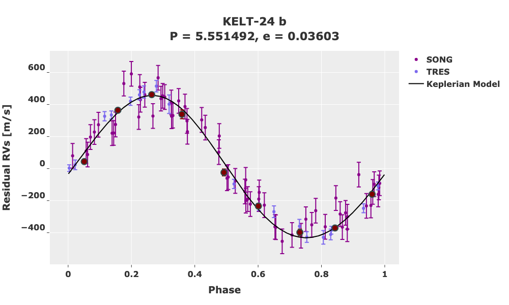
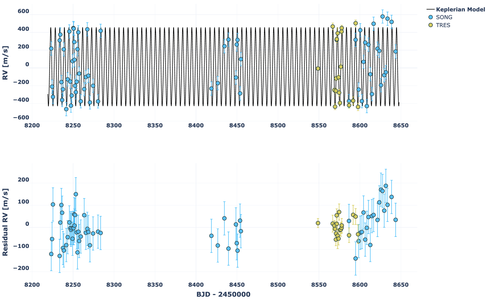

.. _tutorials:

Tutorials
=========

RV Fitting
**********

Example 1
+++++++++

Here we perform Bayesian inference on a radial-velocity dataset. This example fits RVs of KELT-24, known to host a transiting 5.5 day massive hot Jupiter on a moderately eccentric orbit.

.. literalinclude:: ../examples/KELT-24_rv_fitting/kelt24_example.py
    :language: python

The resulting best fit parameters from the max likelihood and mcmc sampling are saved to .pkl files. The best fit parameters from the max likelihood fitting are printed to the terminal:

::

    (Parameter)  Name: per1 | Value: 5.551493310923132
        Priors:
            Gaussian: [5.5514926, 8.1e-06]

    (Parameter)  Name: tc1 | Value: 2457147.0529 (Locked)
        Priors:
            Gaussian: [2457147.0529, 0.002]

    (Parameter)  Name: ecc1 | Value: 0.03424765637223241
        Priors:
            Uniform: [1e-10, 1]
            Gaussian: [0.077, 0.024]

    (Parameter)  Name: w1 | Value: 0.7471046233814415
        Priors:
            Gaussian: [0.9599310885968813, 0.2617993877991494]

    (Parameter)  Name: k1 | Value: 441.5047007138727
        Priors:
            Positive

    (Parameter)  Name: gamma_SONG | Value: 382.3918526498997
        Priors:
            Gaussian: [330.0031415926536, 20]

    (Parameter)  Name: gamma_TRES | Value: 400.17917891086967
        Priors:
            Gaussian: [303.8031415926536, 20]

    (Parameter)  Name: gamma_dot | Value: 0.0 (Locked)
    (Parameter)  Name: gamma_ddot | Value: 0.0 (Locked)
    (Parameter)  Name: jitter_SONG | Value: 69.62453494177453
        Priors:
            Uniform: [1e-10, 100]

    (Parameter)  Name: jitter_TRES | Value: 0.0 (Locked)

The full RV model, data, and residuals.

The phased RVs for each planet.

The corner plot from mcmc sampling.

.. image:: ../examples/KELT-24_rv_fitting/KELT-24_corner_20210211_150814.png

Example 2
+++++++++

Here we perform the same Bayesian inference on KELT-24but use the webpage GUI.

First we modify our Python script. The majority of the code is identicical. Note we also import pychell.stutils.

.. literalinclude:: ../examples/KELT-24_rv_fitting/kelt24_example_streamlit.py
    :language: python

This file is saved as kelt24_example_streamlit.py. We run it as streamlit run ``kelt24_example_streamlit.py``. This will open a webpage that looks like the following:

.. image:: ../examples/KELT-24_rv_fitting/kelt24_streamlit_interface.png

From here one can perform the desired actions. Here, the starting parameters are always what the user specifies in the script. All results are still saved to files, and interactive plots are shown in the browser.