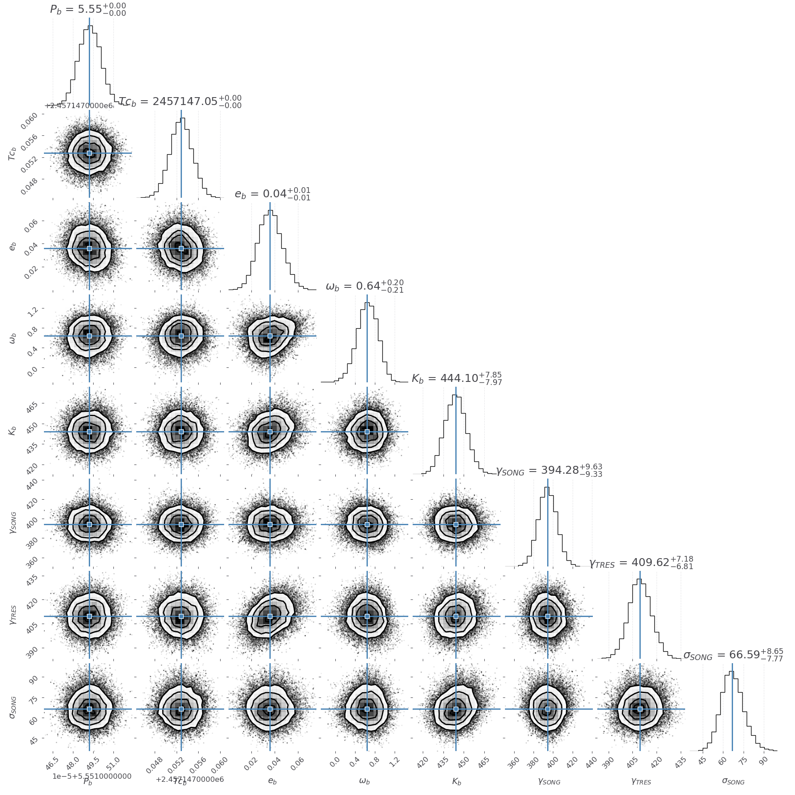
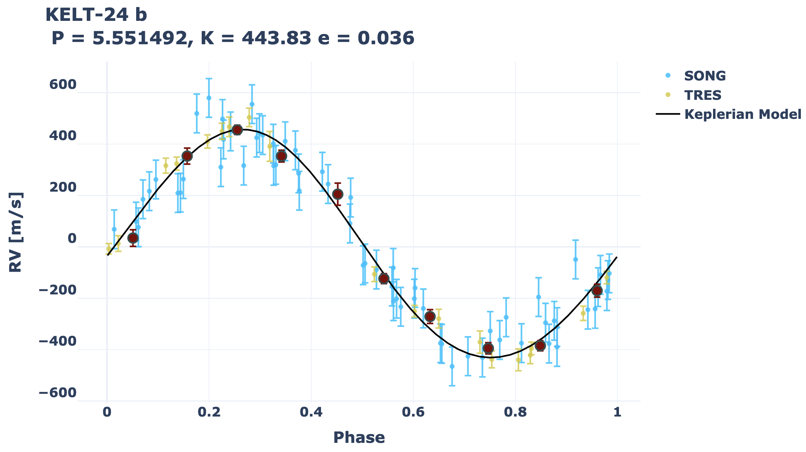

Tutorials
*********

Reduction
=========
Below is an example which reduces and extracts an echellogram of Vega observed with the iSHELL spectrograph in Kgas mode (~2.3 microns).

.. literalinclude:: ../examples/Vega_reduction/vega_ishell_reduction.py
   :language: python

To run the example, open a terminal window and run ``python vega_ishell_reduction_example.py``.

An output directory will be created in an output folder ``Vega``. Each sub folder contains the following:

#. **calib** - Any master dark, bias, and flat calibration images.
#. **spectra** - Reduced and extracted 1-dimensional spectra stored in .fits files. shape=(n_orders, n_traces, n_pixels, 3). The last index is for flux, flux unc, and bad pixels (1=good, 0=bad). The flux and unc are in units of photoelectrons. Plots for each echellogram are also generated.
#. **trace** - Order map information stored in a pickle file.

Computing Radial Velocities
===========================

Below is an example which fits 8 spectra (4 nights) of Barnard's Star spectra observed with iSHELL. Only orders 6, 8, 12, and 15 are fit. The wavelength solution and LSF are constrained from the isotopic methane gas cell.

First, download and extract the templates from here: https://drive.google.com/file/d/1ubwYyH6DidtDfxRdg707-8M9iORS-jql/view?usp=sharing.
Then in the example gj699_ishell_rvs_example.py, change the templates_path variable to the appropriate folder.

.. literalinclude:: ../examples/GJ_699_spec_model/gj699_ishell_specmodel.py
   :language: python

To then run the example, open a terminal window and run ``python gj699_ishell_rvs_example.py``.

Summaries of fits are printed after each fit if verbose=True. An output directory will also be created in an output folder ``ishell_gj699_example``, with each order contained in its own subfolder. Each order then contains the following subfolders:

#. **ForwardModels** - The spectral model fit for each observation and iteration as png plots.
#. **RVs** - Plots of the individual and per-night (co-added) RVs for each iteration, plots of CCF skew vs. RVs for each iteration, and the RVs stored in a ``.npz`` file.
#. **Templates** - Stores stellar templates in .npz files.

A pickle file of the SpectralRVProb object is also saved which may be used to generate wavelength solutions, look at best fit parameters, etc.

Radial Velocity Fitting
=======================

Below is an example which fits RVs of KELT-24 which hosts a transiting hot Jupiter. Here we fit RVs from TRES and SONG.

.. literalinclude:: ../examples/KELT-24_rv_fitting/kelt24.py
   :language: python

To then run the example, open a terminal window and run ``python kelt24.py``. This will perform a maximum a posteriori fit to the RVs followed by MCMC sampling to determine the posterior distributions.

.. image:: ../examples/KELT-24_rv_fitting/kelt24_rvs_full.png

